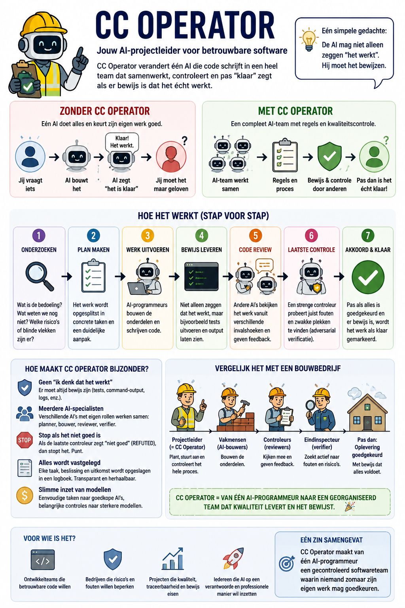
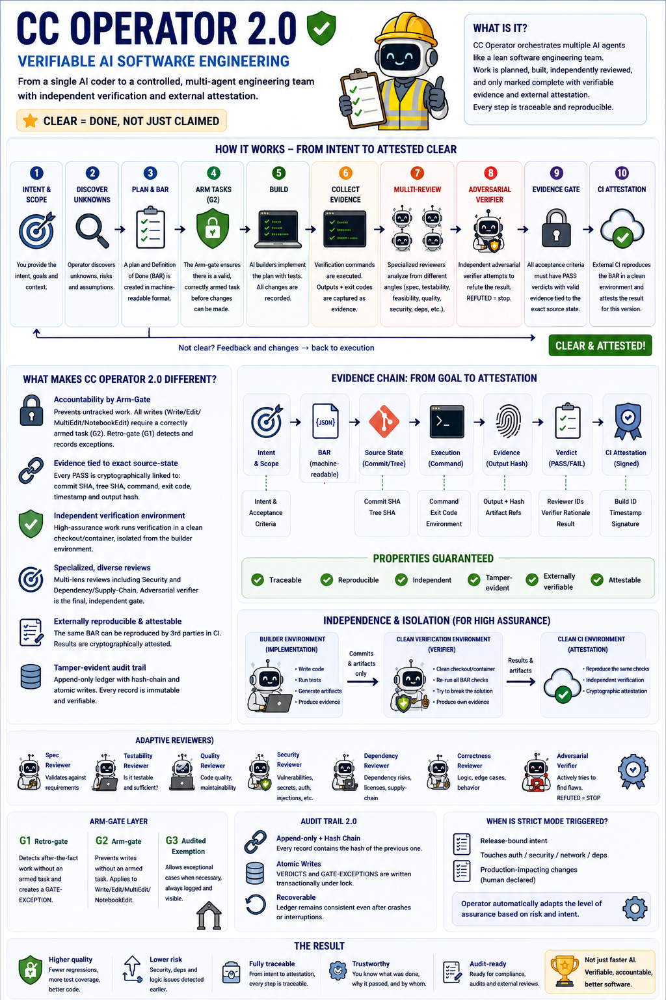

# Infographics

Visual explainers for cc-operator. They are **communication material, not
specification** — `templates/OPERATOR.md` is the charter, `CLAUDE.md` the map,
and this file loses to both on any disagreement.

Two of the three describe a **target state** ("CC Operator 2.0") rather than the
shipped plugin. That distinction is load-bearing here of all places: this
project's own rule is that a claim without evidence is FAIL by definition, and a
diagram is a claim with unusually good graphic design. Each sheet below carries
what it actually depicts, and the roadmap sheets carry a per-property status
table pointing at the issue that would close it.

## Files

| File | Language | Depicts |
|---|---|---|
| `img/cc-operator-overview-nl.png` | Dutch | The shipped model, conceptually — one AI vs. a reviewed team |
| `img/cc-operator-2.0-nl.png` | Dutch | Target state ("2.0") |
| `img/cc-operator-2.0-en.png` | English | Target state ("2.0"), same content as the Dutch sheet |

---

## 1. Overview — what cc-operator is

The closest of the three to what ships today. The seven-step spine (research →
plan → build → evidence → review → adversarial check → done) is the charter's
own flow, the construction-crew analogy maps onto the seat model
(`agents/op-*.md`), and "REFUTED = stop, full stop" is literally how
`workflows/review.js` treats the adversarial seat: a REFUTED verdict never
enters the scoring pool and cannot be outvoted.

One caveat a reader should carry: *"nothing is marked done without evidence"*
describes the mechanism the gate provides, not a law it can enforce. The
evidence gate is **opt-in at the mechanism level** — nothing forces a sentinel
to be opened in the first place (`ops-task.sh` makes it one command; it does not
close the hole). That limitation is recorded in `CLAUDE.md` and is not
new.

---

## 2. CC Operator 2.0 — the target state

Dutch edition: [`img/cc-operator-2.0-nl.png`](img/cc-operator-2.0-nl.png).

**This is a roadmap, not a changelog.** Read as shipped capability it would
overstate the product on five separate axes. Each row below says what exists
today and what would close the gap.

| The sheet claims | Today | Closes it |
|---|---|---|
| Arm-gate layer G1/G2/G3 | Built, **unmerged** (PR #12). G2 is **opt-in** (`.operator/armgate.on`) and `Bash` is ungated by design — the threat model is forgetting, not evasion | merge #12; the remaining hole is G4 |
| "Evidence tied to exact source-state: commit SHA, **tree SHA**, command, **exit code**, **timestamp**, **output hash**" | Partly. A verdict row is stamped `@<sha>` / `+dirty` / `+unknown` / `@no-commit` / `@no-vcs`. **No** tree sha, exit code, timestamp or output hash — and the stamp is provenance ("this row was written from that tree"), never attestation ("that tree passes") | [#22](https://github.com/betmoar/cc-operator-plugin/issues/22) |
| "Independent verification environment — clean checkout / container, isolated from builder state" | **Not implemented.** Builder and adversarial verifier share one working tree. Measured: a `__pycache__` left by the builder makes a broken commit verify CONFIRMED in-tree and REFUTED in a clean checkout of that same commit, with `git status --porcelain` clean throughout | [#23](https://github.com/betmoar/cc-operator-plugin/issues/23) |
| "Security Reviewer" and "Dependency Reviewer" seats | **Not implemented.** `workflows/review.js` dispatches a fixed five lenses — spec, testability, feasibility, quality, correctness — unconditionally. No security or supply-chain lens exists | [#24](https://github.com/betmoar/cc-operator-plugin/issues/24) |
| "CI attestation — cryptographically signed, externally reproducible" | **Not implemented.** BAR blocks are hand-written prose with no schema, and neither CI workflow reads the ledger | [#25](https://github.com/betmoar/cc-operator-plugin/issues/25) |
| "Audit trail 2.0 — hash chain, atomic writes" | **Not implemented.** The ledger is append-only under a lock, with no hash chain. The verdict row and its `GATE-EXCEPTION` are two appends, so a crash between them loses the audit line | [#14](https://github.com/betmoar/cc-operator-plugin/issues/14) |

What the sheet gets right about direction: the chain *intent → BAR → source
state → execution → evidence → verdict → attestation* is the correct spine, and
it is the one the open unknowns are organized around. The gap between the
picture and the tree is the backlog, stated honestly rather than sanded off.

## Updating these

The sheets are exported images with no source in this repo, so a correction
means re-exporting and replacing the file. If a claim on a sheet becomes true,
move its row out of the table above rather than deleting the row — a reader
should be able to see that the question was asked and how it was settled, which
is the same rule `docs/UNKNOWNS.md` applies to closing an unknown.
